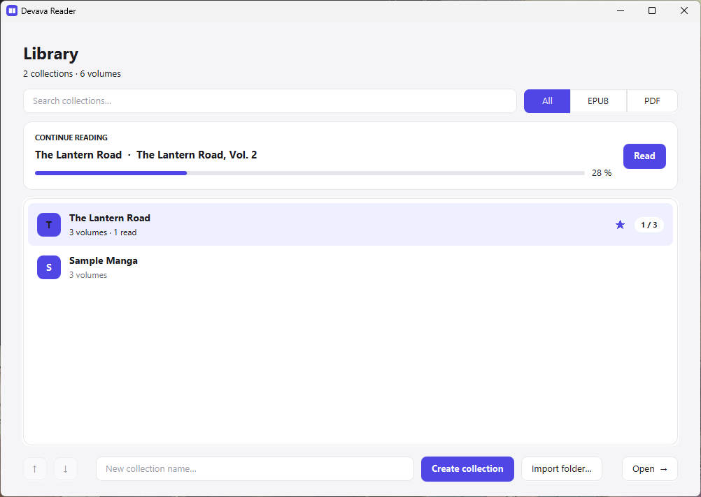
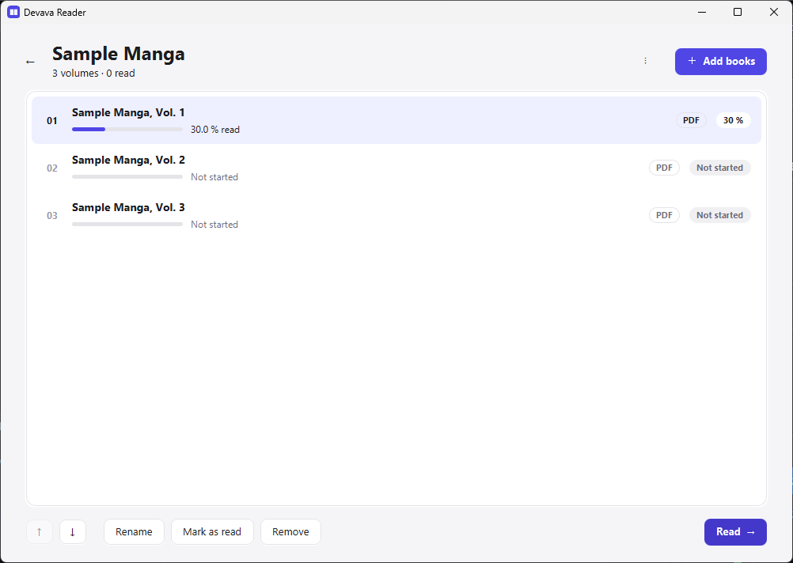
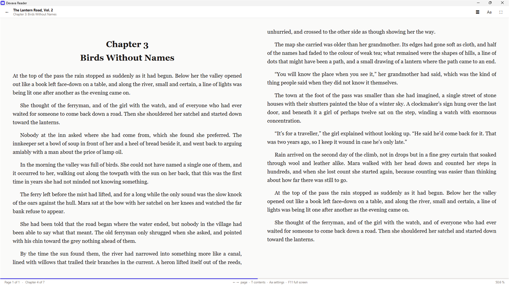
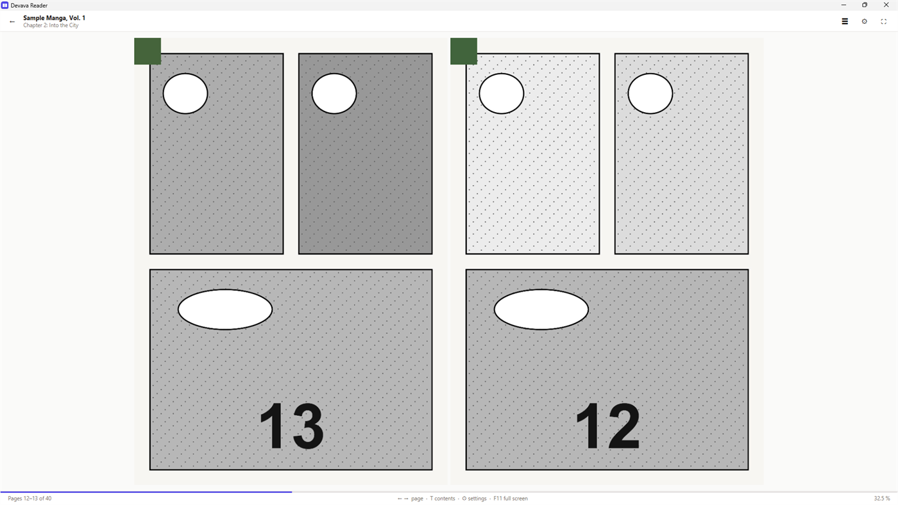

# Devava Reader

[](https://github.com/HideOnVava/devava-reader/releases/latest)
[](https://github.com/HideOnVava/devava-reader/actions/workflows/ci.yml)
[](#download)
[](LICENSE)

A minimal, distraction-free desktop reader for **EPUB novels** and **PDF manga**, organized in
collections — built by **devava XP Studios** for Windows, macOS and Linux.

Keep long series (light novels, sagas, manga) in collections, in the order *you* want, and
pick up every volume exactly where you left it. No accounts, no cloud, no Java to install:
one download and it runs.

| Library | Collection |
| --- | --- |
|  |  |

| EPUB reader | PDF / manga reader |
| --- | --- |
|  |  |

## Download

**[⬇ Download the latest version](https://github.com/HideOnVava/devava-reader/releases/latest)**
— 64-bit Windows 10/11, macOS 12 or later, or a Linux desktop. Nothing else is needed.
On that page, under **Assets**, pick the file for your system:

| System | File | Then |
| --- | --- | --- |
| **Windows** | `…-windows-x64-setup.exe` | Open it. If Windows shows *"Windows protected your PC"*, click **More info → Run anyway** ([why](#why-do-windows-and-macos-show-a-warning)). Keep the suggested folder and finish: Devava Reader appears in the Start menu and, unless you untick the box, on the desktop. No administrator rights needed. |
| Windows, no install | `…-windows-x64-portable.zip` | Unzip anywhere (a USB stick works) and open `Devava Reader.exe`. |
| **macOS** (Apple Silicon: M1 or later) | `…-macos-arm64.dmg` | Open the image and drag *Devava Reader* to *Applications*. The first launch is blocked because the app is not notarized: go to **System Settings → Privacy & Security**, scroll to the *Devava Reader* message and click **Open Anyway** ([why](#why-do-windows-and-macos-show-a-warning)). Only once. |
| macOS (Intel) | `…-macos-x64.dmg` | Same as above. |
| **Linux** (Ubuntu, Debian, Mint…) | `…-linux-x64.deb` | Double-click it, or `sudo apt install ./Devava-Reader-<version>-linux-x64.deb`. *Devava Reader* appears in the applications menu. |
| Linux (Fedora, openSUSE…) | `…-linux-x64.rpm` | `sudo dnf install ./Devava-Reader-<version>-linux-x64.rpm` (or `zypper`). |
| Linux, any distribution | `…-linux-x64.tar.gz` | `tar xf` it and run `Devava Reader/bin/Devava Reader`. Needs GTK 3, which every desktop has. |

### First steps

1. **Create a collection** — the quick way: click *Import folder…* (or drop a folder onto the
   library) and pick the folder of a series; the collection takes the folder's name and every
   `.epub` / `.pdf` inside becomes a volume. Or type a name and click *Create collection* to
   start with an empty one.
2. **Add books** — open the collection and click *＋ Add books*, or drag `.epub` / `.pdf` files
   (or folders) onto the list. Volumes are sorted naturally on import (*Volume 2* before
   *Volume 10*) and you can reorder them with the arrow buttons.
3. **Read** — double-click a volume. Turn pages with `→` / `←`, the mouse wheel or by clicking
   the page edges; press `Esc` to go back. Progress is saved as you read, and the *Continue
   reading* card on the first screen takes you straight back to the last book.

### Updating

Install the new version the same way: on Windows the installer replaces the previous version
in place, on macOS drag the new app over the old one, on Linux install the new package (or
unzip the new tarball and delete the old folder). Your library — collections, volumes,
reading progress and settings — is kept.

### Uninstalling

Windows: *Settings → Apps → Installed apps → Devava Reader → Uninstall*. macOS: drag the app
to the Trash. Linux: `sudo apt remove devava-reader` (or `dnf`), or delete the extracted
folder. Portable versions: just delete the folder. Your library file stays in your Documents
folder (`Devava Reader/library.json`) in case you come back; your book files are never moved,
copied or modified by the app.

### Why do Windows and macOS show a warning?

The downloads are not code-signed — a Windows signing certificate and an Apple developer
account cost money every year, and this is a free project. Windows therefore shows *"Windows
protected your PC"* the first time (*More info → Run anyway*), and macOS blocks the first
launch (*Privacy & Security → Open Anyway*); after that, both systems remember your choice.
Every release is built automatically by GitHub Actions from the tagged source code, so the
build log shows exactly what went into the files, and each release lists their SHA-256
checksums.

## Features

- **Collections** of volumes with custom ordering, progress bars and read/unread status. A
  collection can mix `.epub` and `.pdf` volumes.
- **Import a folder as a collection**: one click (or one drop) turns the folder of a series
  into a collection with all its volumes in order; drop it again later and only the new
  volumes are added.
- **Library search and filters**: find collections by name, filter them by the format of their
  volumes (all / EPUB only / PDF only), pin favourites so they always stay on top, and reorder
  collections manually.
- **EPUB reader** with a two-page (or single-page) view and exact pagination: no lost or
  clipped pages. Table of contents side panel (EPUB 3 `nav` and EPUB 2 NCX), footnote and
  internal links that open in place with a back button, font size, serif/sans typeface, one or
  two columns, and progress weighted by chapter size.
- **PDF / manga reader**: pages rendered as images (Apache PDFBox), single or double-page
  spreads with the cover alone and wide pages shown on their own, left-to-right or
  right-to-left reading direction, fit to the whole page or to the width (with scrolling), the
  PDF outline as a table of contents, and progress by page.
- **Bookmarks with notes** in both readers: press `B` on any page, find it again in the
  side panel (`T`, *Bookmarks* tab) with the first words of the page and your note.
- **Search inside the book** (EPUB): `Ctrl+F`, type, and jump straight to any occurrence;
  accents and case do not matter.
- **Light / sepia / dark themes** shared by both readers.
- **"Continue reading"** card on the main screen.
- Drag & drop `.epub` / `.pdf` files or folders onto a collection, and folders onto the
  library; natural sort on import (Volume 2 before Volume 10).
- Everything is stored in a single JSON file that the app creates on first launch.

## Keyboard shortcuts

On macOS, `Ctrl` in the tables below means `⌘`.

### EPUB reader

| Key | Action |
| --- | --- |
| `→` `Space` `PgDn` `↓` | Next page (also mouse wheel and clicking the right edge) |
| `←` `Shift+Space` `PgUp` `↑` | Previous page (mouse wheel, clicking the left edge) |
| `Ctrl+→` / `Ctrl+←` | Next / previous chapter |
| `Home` / `End` | Start / end of the chapter (`Ctrl` = of the book) |
| `B` | Bookmark this page (again: remove the bookmark) |
| `T` | Side panel: table of contents, bookmarks and search (`Tab` switches between them) |
| `Ctrl+F` | Search inside the book (side panel, *Search* tab) |
| `Backspace` / `Alt+←` | Go back to where you were before following a link |
| `Ctrl` `+` / `Ctrl` `-` | Font size |
| `1` / `2` | One or two columns |
| `F11` | Full screen |
| `Esc` | Close contents / leave full screen / back to the collection |

The **Aa** button opens the settings popup: font size, typeface, theme and columns.
They are saved with the library.

In the *Bookmarks* tab of the side panel, `Enter` or a click jumps to the bookmark, `N` (or
`F2`) edits its one-line note and `Delete` removes it; the same works in the PDF reader. A
bookmark remembers the chapter and the exact page position, plus the first words of the page
so it can be recognised without opening the book. Bookmarks are saved with the library.

In the *Search* tab, results appear as you type (two characters or more) with the chapter and
the passage around each match; `Enter` in the field jumps to the first (or the selected)
result, `↓` moves to the list, and `Enter` or a click on a result jumps to that occurrence,
which is selected on the page. The panel stays open, so `↓` `Enter` walks through the results;
`Esc` closes it and `Backspace` returns to where you were before the jump. Matching ignores
case and accents ("cancion" finds "canción") and typographic quotes.

### PDF / manga reader

| Key | Action |
| --- | --- |
| `→` / `←` | Turn to the page drawn on the right / left (so they follow the reading direction); also clicking the right / left edge |
| `Space` `PgDn` `↓` | Next spread — in fit-to-width mode, scroll down first |
| `Shift+Space` `PgUp` `↑` | Previous spread — in fit-to-width mode, scroll up first |
| Mouse wheel | Next / previous spread (scrolls the page first when it is taller than the window) |
| `Home` / `End` | First / last spread |
| `1` / `2` | Single page / double page (the cover and wide pages always stand alone) |
| `R` | Toggle reading direction (left-to-right / right-to-left, for manga) |
| `W` | Toggle fit: whole page / width |
| `B` | Bookmark this page (again: remove the bookmark) |
| `T` | Side panel: the PDF outline (when the file has one) and bookmarks (`Tab` switches) |
| `F11` | Full screen |
| `Esc` | Close contents / leave full screen / back to the collection |

The **⚙** button opens the settings popup: layout, reading direction, fit and theme. They are
saved with the library and apply to every PDF. Reaching the end of the last spread and turning
once more marks the volume as read.

### Library and collections

In the library: type in the search box to filter collections by name (`Esc` clears it, `↓`
jumps to the list), the **All / EPUB / PDF** buttons filter by the format of the volumes a
collection holds (a collection only counts as "EPUB" or "PDF" when every volume in it has
that format; empty or mixed collections only appear under *All*), right-click a collection to
**pin** or unpin it (pinned collections are always listed first), and `Ctrl+↑` / `Ctrl+↓` or
the arrow buttons move a collection within its group. Moving is only available while the full,
unfiltered list is shown, so that a position always means the real position.

**Importing a folder**: *Import folder…* (or dropping one or more folders anywhere on the
library) creates a collection named after each folder, with the `.epub` and `.pdf` files
inside it as volumes in shelf order — the files of the folder first, in natural order, then
each subfolder in turn (subfolders are searched up to eight levels deep; hidden entries are
skipped). If a collection with that name already exists, the files it does not have yet are
added at the end instead, so dropping the same folder again after new volumes arrive adds just
those. Folders with no books, and folders far too large to be a series, are reported and left
alone. The files themselves are never moved or copied.

In a collection: `Enter` or double-click opens the reader (the EPUB or the PDF one, depending
on the volume), `F2` renames, `Del` removes the volume, `Ctrl+↑` / `Ctrl+↓` reorder, and
`.epub` / `.pdf` files — or folders, whose books are added — can be dropped onto the list. PDF
volumes show a small **PDF** badge.

## Where the data lives

The library file `library.json` is created automatically on first launch in a
`Devava Reader` folder inside your documents:

- **Windows**: `<Documents>\Devava Reader\`, where `<Documents>` is the real Documents folder
  reported by Windows (OneDrive redirection is honored).
- **macOS**: `~/Documents/Devava Reader/`.
- **Linux**: the XDG Documents folder (`~/Documents`, `~/Documentos`… as configured by the
  desktop), or `~/.local/share/devava-reader/` on systems without one.

No manual setup is needed.

- Override the location with `-Dreader.library=path/to/library.json` (when running from
  source) or with the environment variable `JAVA_TOOL_OPTIONS=-Dreader.library=…` (packaged app).
- Writes are atomic; a corrupt file is preserved as `library.corrupt-<date>.json`.
- A library created by an earlier version of the app (Spanish field names under
  `Documents\MiLector\biblioteca.json`) is imported automatically the first time, so no reading
  progress is lost. The old file is left untouched.
- Every volume records its `format` (`epub` or `pdf`, derived from the file extension), and
  every collection records its position and whether it is pinned. Files written before these
  fields existed load normally and get them filled in.

While a book is open, its EPUB is extracted to `%TEMP%\DevavaReader\<id>` and removed on exit.
PDFs are read in place; nothing is extracted.

---

## For developers

Java 21, JavaFX 21, Maven (wrapper included), Gson, Apache PDFBox. Unit tests with JUnit 5;
the compiler runs with `-Xlint:all` and the build is expected to stay warning-free.

### Running from source

Requirements: JDK 21 and an internet connection for the first Maven build.

```bash
./mvnw javafx:run
```

From IntelliJ IDEA: open the folder as a Maven project and run `com.devavaxp.reader.ReaderApp`
(or `Launcher`).

Tests:

```bash
./mvnw test
```

## Building the application

This turns the source code into the same thing the [releases](https://github.com/HideOnVava/devava-reader/releases)
contain: an application with a bundled Java runtime that runs without Java installed. Each
system builds its own package on that system (Windows makes the `.exe`, Linux the `.deb`,
macOS the `.dmg` — that is how `jpackage` works). The steps below assume you have never done
this before. Windows first, then [Linux and macOS](#on-linux-and-macos).

### 1. Install a JDK 21 (once)

The JDK is the Java development kit: it contains the compiler and the two tools that build
the application (`jlink` and `jpackage`).

1. Go to <https://adoptium.net/temurin/releases/?version=21&os=windows&arch=x64&package=jdk>
   and download the **JDK** (not the JRE) **21** installer for Windows x64 (`.msi`).
2. Run it. In the *Custom Setup* page, enable **"Set JAVA_HOME variable"** — the build script
   uses that variable to find the JDK. Keep the rest as it is and finish.
3. Open a **new** PowerShell window (Start menu → type `powershell` → Enter) and check:

   ```powershell
   java -version
   ```

   The first line must say version **21** (for example `openjdk version "21.0.9"`).
   If it shows an older version or "not recognized", a different Java is first on your PATH;
   the script can be told where the JDK is with `-JdkHome "C:\Program Files\Eclipse Adoptium\jdk-21..."`.

### 2. Get the source code

Either of these:

- **Without Git**: on the repository page click the green **Code** button → **Download ZIP**,
  then extract the ZIP somewhere simple, for example `C:\Projects\devava-reader`.
- **With Git** (if you have it):

  ```powershell
  git clone https://github.com/HideOnVava/devava-reader.git C:\Projects\devava-reader
  ```

### 3. Open PowerShell in the project folder

In File Explorer, open the folder that contains `pom.xml` and `mvnw.cmd`, click in the
address bar, type `powershell` and press Enter. A PowerShell window opens already positioned
in that folder (the prompt shows its path).

### 4. Run the build script

```powershell
powershell -ExecutionPolicy Bypass -File .\packaging\build-windows.ps1
```

`-ExecutionPolicy Bypass` is needed because Windows blocks unsigned scripts by default; it only
applies to this one command. What happens next:

1. Maven compiles the project. **The first run downloads the build tool and the libraries
   (JavaFX, PDFBox, Gson — a few hundred MB) and takes several minutes**; later runs are fast.
2. `jlink` assembles a trimmed Java runtime with only the modules the app needs.
3. `jpackage` combines runtime, application and icon into the app image.

When it finishes it prints `Built: …\dist\Devava Reader`. That folder is the application:
double-click `dist\Devava Reader\Devava Reader.exe` to run it, or copy the whole folder
anywhere you like (that folder, zipped, is exactly the portable download of a release).

### 5. Optional: install it for yourself, with a desktop shortcut

```powershell
powershell -ExecutionPolicy Bypass -File .\packaging\build-windows.ps1 -Destination "$env:LOCALAPPDATA\Programs" -Shortcut
```

This puts the app in `%LOCALAPPDATA%\Programs\Devava Reader` (your user's programs folder, no
administrator rights) and creates *Devava Reader* on the desktop. Running the same command
again after changing the code replaces it.

### 6. Optional: build the installer (`-setup.exe`)

The installer is the app image wrapped by the **WiX Toolset 3.x**, a free Microsoft-backed
tool that `jpackage` uses to create Windows installers.

1. Download `wix314.exe` from <https://github.com/wixtoolset/wix3/releases> and install it
   (it may ask for the .NET Framework 3.5 — accept). The installer sets the `WIX` environment
   variable that the script looks for.
2. Open a new PowerShell window in the project folder and run:

   ```powershell
   powershell -ExecutionPolicy Bypass -File .\packaging\build-windows.ps1 -Type exe
   ```

The result is `dist\Devava Reader-<version>.exe`: a per-user installer with a folder chooser,
Start menu and desktop shortcuts, and an *Uninstall* entry in Windows Settings. Installing a
newer version over an older one upgrades it in place.

### If something goes wrong

| Message | What it means / what to do |
| --- | --- |
| `jlink/jpackage/jmods not found` | `JAVA_HOME` does not point to a full JDK 21. Re-run the JDK installer with *Set JAVA_HOME* enabled, open a new PowerShell window, or pass `-JdkHome "C:\path\to\jdk-21"`. |
| `running scripts is disabled on this system` | The command was run without `-ExecutionPolicy Bypass`; use the exact command from step 4. |
| `Maven build failed` with network errors | The first build needs internet access to download the libraries. Check the connection (or proxy) and run the script again. |
| `The WiX Toolset 3.x is required` | Only for `-Type exe` / `msi`: install WiX as in step 6 and open a new PowerShell window. |
| *Windows protected your PC* when starting the built app | Normal for unsigned programs: *More info → Run anyway*. |

### On Linux and macOS

The same build, driven by `packaging/build-unix.sh` (a Bash script) instead of the PowerShell one.

1. **Install a JDK 21** with `jmods` (a full JDK, not a JRE):
   - macOS: `brew install --cask temurin@21`, or the `.pkg` from
     <https://adoptium.net/temurin/releases/?version=21> (choose *macOS*, your chip: *aarch64* for
     Apple Silicon, *x64* for Intel, package *JDK*).
   - Ubuntu / Debian: `sudo apt install openjdk-21-jdk` (Ubuntu 24.04+, Debian 12+ have it), or
     the Adoptium `.tar.gz` from the same page, extracted anywhere.
   - Fedora: `sudo dnf install java-21-openjdk-devel java-21-openjdk-jmods`.

   Check with `java -version` (must say 21). If another Java comes first, pass
   `--jdk-home /path/to/jdk-21` to the script.
2. **Get the source**: `git clone https://github.com/HideOnVava/devava-reader.git` (or *Code →
   Download ZIP* on GitHub and extract it), then `cd devava-reader`.
3. **Build the application**:

   ```bash
   packaging/build-unix.sh
   ```

   The first run downloads Maven and the libraries (a few hundred MB, several minutes). The
   result is `dist/Devava Reader/` on Linux (run `dist/Devava Reader/bin/Devava Reader`) or
   `dist/Devava Reader.app` on macOS (double-click it, or move it to *Applications*).
4. **Optional: build a package** — `packaging/build-unix.sh --type deb` (Debian/Ubuntu; needs
   `fakeroot`: `sudo apt install fakeroot`), `--type rpm` (needs `rpm-build`), or
   `--type dmg` on macOS (needs nothing extra). Add `--reuse-image` to skip recompiling when
   the app image was just built.

If `packaging/build-unix.sh` says *Permission denied*, run `chmod +x packaging/*.sh` (this
happens when the source came as a ZIP instead of `git clone`).

### How the build works

`build-windows.ps1` and `build-unix.sh` do the same thing: compile with the Maven wrapper,
copy the dependencies, build a runtime image with `jlink` (the JDK modules listed in
`packaging/jdk-modules.txt` plus the JavaFX modules for that platform) and call `jpackage` with
that runtime and the application jars on the class path; the version number is read from
`pom.xml`. Inside the image the application and its libraries run from the class path while
JavaFX lives in the runtime image as proper modules: PDFBox ships as automatic modules, which
`jlink` cannot link. When run from source (`javafx:run`, IDE) everything is on the module path
instead, which is why `module-info.java` also requires `org.apache.commons.logging` — PDFBox
needs it but, being automatic, cannot declare it. Installers and disk images are built from
that same image with `--app-image`, so the portable download and the installer of a release
contain identical bits.

## Releasing a new version

Releases are built and published by GitHub Actions ([`.github/workflows/release.yml`](.github/workflows/release.yml))
so that every download comes from a clean, reproducible build of a tagged commit — nothing is
uploaded from a developer's PC. To publish, for example, version 1.3.0:

1. Set `<version>1.3.0</version>` in `pom.xml`.
2. Add a `## [1.3.0] - <date>` section to [`CHANGELOG.md`](CHANGELOG.md) describing the
   changes (it becomes the "What's new" text of the release) and the link reference at the
   bottom of the file.
3. Commit and push, then create and push the tag:

   ```bash
   git tag v1.3.0
   git push origin v1.3.0
   ```

4. The **Release** workflow starts automatically. Four jobs build in parallel — Windows,
   Linux (on Ubuntu 22.04, so the `.deb` also installs on older releases), macOS Apple Silicon
   and macOS Intel — each one checks that the tag matches `pom.xml`, runs the tests, builds its
   files with `packaging/release.ps1` or `packaging/release.sh`, and then **smoke-tests the
   result on a real desktop session**: the packaged app is installed, started with a generated
   sample library (`tools/samples`), driven through the library, the EPUB reader, the PDF
   reader and the system folder dialog with real keyboard events (`tools/smoke`), and closed;
   the screenshots and the app log are kept as workflow artifacts. A final job gathers everything, computes the
   SHA-256 checksums, generates the notes from the changelog (`packaging/release-notes.ps1`)
   and publishes the release. It appears under **Releases** after about ten minutes.

To rehearse without publishing, open **Actions → Release → Run workflow**: the same builds and
smoke tests run and the files are attached to the workflow run as artifacts instead of a
release. The scripts can also be run locally (`.\packaging\release.ps1` on Windows — add
`-SkipInstaller` when WiX is not installed — or `packaging/release.sh` on Linux/macOS); their
output in `dist/release` is what the workflow uploads.

## Project layout

```
com.devavaxp.reader
├── ReaderApp / Launcher        startup, single window and window preferences
├── Navigator                   screen switching on a single Scene; picks the reader by format
├── CollectionsController       library: search, filters, pinning, ordering, folder import,
│                               "continue reading"
├── VolumesController           volumes of a collection: import (files/folders), order, mark, read
├── ReaderController            EPUB reader: chapters, keyboard/mouse, contents, settings, progress
├── PdfReaderController         fixed-page reader: spreads, direction, fit, background rendering
├── ReaderSidePanel             Contents | Bookmarks | Search tabs of the readers' side panel
├── BookmarksPane               bookmark list shared by both readers: jump, note, remove
├── UiControls                  small controls built in code (segmented rows, vector icons)
├── Dialogs                     dialogs styled like the app
├── bridge/JsBridge             object exposed to reader.js (link clicks, events)
├── data/DataManager            JSON persistence (Gson), atomic and fault-tolerant, legacy import,
│                               collection order/pinning, format queries, folder import
├── data/AppDirectories         per-system Documents / library folder and shortcut key name
├── data/BookFolder             books inside a folder, in shelf order, for importing
├── data/TextUtils              natural order, titles, plurals
├── epub/EpubExtractor          safe ZIP extraction into the temp cache
├── epub/EpubParser             container.xml → OPF (spine, manifest) → nav / NCX (contents)
├── epub/EpubBook               reading order, table of contents and size-weighted progress
├── epub/ChapterText            plain text of a chapter, for searching
├── epub/BookSearch             case- and accent-insensitive search with context snippets
├── pdf/PageSource              what the fixed-page reader needs from a book (pages, sizes,
│                               rendering, outline) — the seam for other formats, e.g. CBZ
├── pdf/PdfPageSource           PageSource backed by Apache PDFBox
├── pdf/PageSpreads             grouping of pages into single / double-page spreads
└── model/                      BookCollection, Book, Bookmark, Preferences
resources/com/devavaxp/reader
├── *.fxml, styles.css          views and stylesheet
└── reader.js                   pagination engine (injected into every EPUB chapter)
packaging/
├── build-windows.ps1           jlink + jpackage build (app image, .exe / .msi installer)
├── build-unix.sh               the same for Linux (.deb / .rpm) and macOS (.dmg / .pkg)
├── jdk-modules.txt             JDK modules linked into the runtime, shared by both scripts
├── release.ps1 / release.sh    release files of one platform + checksums
├── release-notes.ps1           gathers every platform's files, checksums and release text
├── release-notes.md            template of the release text
└── icon.ico / .icns / .png     application icon for Windows / macOS / Linux
tools/
├── samples/                    generators of sample books and a sample library (original content)
└── smoke/                      per-system smoke tests that drive the packaged app and take screenshots
.github/workflows/
├── ci.yml                      build and tests on every push / pull request (three systems)
└── release.yml                 build, smoke-test and publish a release from a version tag
docs/screenshots/               images used by this README
```

## How EPUB pagination works

Each spine file is loaded into the `WebView` and `reader.js` turns the `<body>` into a
multi-column container exactly as tall as the window. A "view" is two columns (or one).
The key points, verified empirically against the WebKit build shipped with JavaFX:

- The effective width is rounded to a multiple of the column count, so the column pitch is
  an integer and every view starts on an exact pixel (`view × width`).
- Views are moved with `transform: translateX(...)` on the `<body>`, but **`scrollWidth` is
  never measured with the transform applied**: in this WebKit the transform itself shrinks
  `scrollWidth`, which used to cause premature chapter jumps.
- The column count is `round((scrollWidth + padding) / pitch)`, tolerant to any sub-pixel
  deviation, capped by the last column that holds real content (avoids blank pages caused by
  trailing margins).
- `column-count: 1` does not create a multi-column context in WebKit; an explicit
  `column-width` is used instead.
- Images that do not fit in what is left of a column (which WebKit would "slice") are shrunk
  to the available space.
- On window resize, font-size or column changes the text being read stays in place
  (anchored through `caretRangeFromPoint`).

The position is stored as `chapter:fraction`, and the overall percentage is weighted by the
size of each chapter.

## How the PDF reader works

`PdfReaderController` only talks to a `PageSource`: page count, page sizes (with the page
rotation applied), an image for a page at a given scale, and an outline. `PdfPageSource`
implements it with PDFBox, reading the file on demand and caching decoded streams in
temporary files rather than in the heap, which keeps large scanned volumes cheap to open.

Pages are grouped into spreads by `PageSpreads`: one page each in single layout; in double
layout the cover stands alone, the rest are paired (2–3, 4–5, …) the way printed comics are
bound, and a landscape page — a two-page spread scanned as one image — stands alone with the
pairing carrying on after it. The reading direction only decides on which side of the spread
each page is drawn, and `→` / `←` always turn towards the side they point at.

Each visible page is sized from the viewport (one shared scale per spread, so the two pages
line up) and rendered on a single background thread at that pixel width, multiplied by the
screen scale on HiDPI displays; render widths are rounded up to 64-pixel buckets so small
window changes reuse the cached image. Results are applied only if that page is still on
screen at that size, the neighbouring spreads are prefetched, and an LRU cache keeps the
last eight images. The position is stored as `page:0`, so the same `savedPosition` field
serves both readers.

## License

Copyright © 2026 devava XP Studios. Released under the [MIT License](LICENSE).

The packaged Windows build bundles third-party components under their own licenses:
OpenJFX (GPL v2 with the Classpath Exception), Gson (Apache License 2.0) and Apache PDFBox
with FontBox and Commons Logging (Apache License 2.0).
